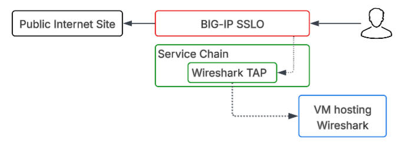
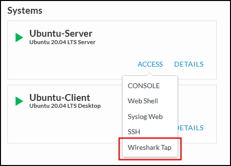
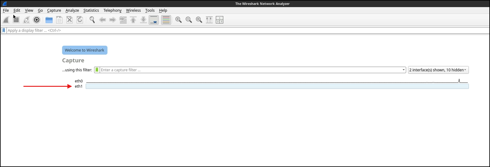
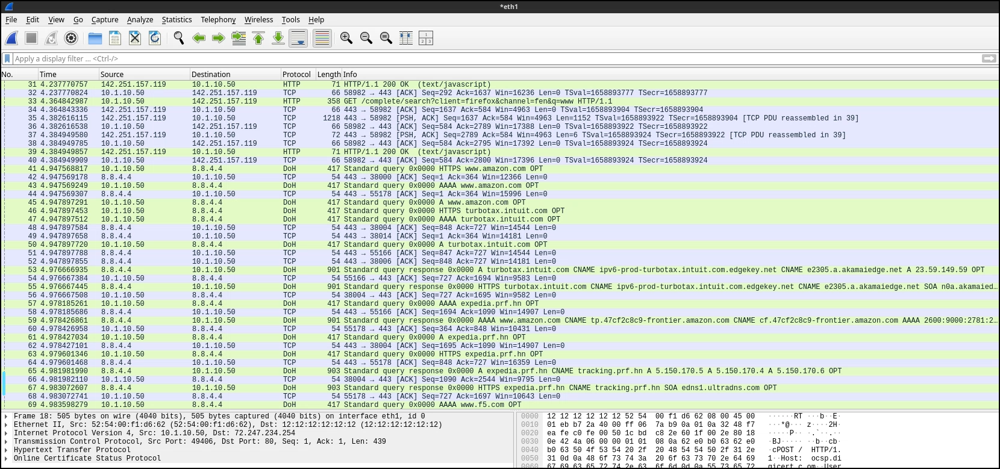

Automating a new L3 Outbound Deployment with TAP Service
================================================================================

In this section, we are working with a clean slate of configuration on the BIG-IP SSL Orchestrator. We will be deploying a fresh Outbound Layer 3 Transparent Proxy Topology with a TAP Service for sending a constant stream of data to a Wireshark instance. 

You will accomplish the following:
 - Review Ansible playbooks needed for this deployment
 - Deploy a new complete L3 Outbound Topology with TAP Inspection Service using automation
 - Confirm TAP Inspection Service functionality by analyzing traffic in Wireshark

|

What is a TAP Service?
----------------------
In F5 BIG-IP SSL Orchestrator, a TAP Service is used to capture traffic before it is re-encrypted and sent on to its destination, allowing you to see the traffic in clear text for analysis. This traffic is sent to a receive-only service (e.g., Wireshark, or IDS) in an out-of-band manner. This can be invaluable for troubleshooting, performance analysis, and security monitoring, as it provides insights into the behavior of the traffic.

|

Building a new L3 Outbound Transparent Proxy with the Wireshark TAP Service
-------------------------------------------------------------------------------

#. To build this new L3 Outbound Transparent Proxy, we will be using Ansible Playbooks to automate the configuration process on the BIG-IP SSL Orchestrator. This will allow us to quickly and efficiently deploy the new topology without having to manually configure each component through the GUI.

#. This will be a complete deployment of a new L3 Outbound Transparent Proxy Topology, so the playbook will be building out the following components:

   - New L3 Outbound Transparent Proxy Topology ``ansible_l3_outbound``
   - New TAP Service to send traffic to Wireshark ``ansible_insp_tap``
   - New Service Chain to link the new topology and TAP service together ``ansible_chain``
   - New Security Policy with rules to steer traffic into the new topology ``ansible_sec_pol_out``
   - New SSL Configuration for the new topology ``ansible_ssl_out``

#. Use the following command to deploy the configuration for the new L3 Outbound Transparent Proxy Topology with TAP Service:

   .. code-block:: text

       ansible-playbook -i notahost, appworld_ansible_playbooks/l3_outbound_full_deploy.yaml

   .. note:: Check the output of the playbook execution to ensure that all tasks were completed successfully. If there are any errors, review the output to identify and let a lab assistant know.

#. Once the playbook has completed successfully, take a few moments to explore the new configuration on the BIG-IP SSL Orchestrator through the GUI. You should see the new topology, service, service chain, security policy, and SSL configuration all in place and ready to go.

   .. image:: images/sslo-ansible-deployment.png
      :align: left

   .. image:: images/sslo-ansible-deployment-chain.png
      :align: left
   
|

Testing the new the Wireshark TAP Inspection Service
-------------------------------------------------------------------------------
Wireshark TAP Inspection Service Flow Diagram

|

#. To test the new Wireshark TAP Inspection Service, we will be using the Ubuntu Server instance that is part of our lab environment. This instance has Wireshark installed and configured to capture traffic from the TAP service.

#. In the UDF Deployment screeen, click on the *ACCESS* dropdown on the Ubuntu-Server Instance and select *Wireshark TAP*.

|

#. This will open a new browser tab and display the Wireshark interfaces available on the Ubuntu Server. Select the interface that corresponds to the incoming TAP service (it will be labeled ``eth1``) and double click on it to start viewing traffic.

.. note:: You may not see any traffic immediately. This is because the TAP service only captures traffic that is flowing through the new L3 Outbound Transparent Proxy Topology, so we will need to generate some traffic to see it in action.

#. After you have the Wireshark capture started, go back to the Ubuntu-Client WebRDP session and generate some traffic by accessing a website that will be steered through the new L3 Outbound Transparent Proxy Topology. For example, you can try accessing ``http://www.f5.com``.

#. Now go back to the Wireshark instance and you should see traffic you just generated flowing through to the Wireshark endpoint in clear text. You can analyze the traffic to see the details of the requests and responses, as well as any potential issues or insights that can be gained from the traffic.  Notice everything is decrypted and in clear text, which is the benefit of having the TAP Inspection Service in place to capture the traffic before it is re-encrypted and sent on to its destination.

.. note:: You can use various filters in Wireshark to focus on specific traffic of interest, such as filtering by IP address, protocol, or specific HTTP requests. This will allow you to gain deeper insights into the behavior of the traffic and the effectiveness of your SSL Orchestrator configuration.

Example Wireshark filters to try:
   - http
   - dns
   - ip.src == <client IP address>
   - ip.dst == <destination IP address>
   - ip.src == <client IP address> && http
   - ip.src == <client IP address> && http.host contains "<host of interest>"

|

This Wireshark TAP service provides a powerful tool for gaining visibility into the traffic flowing through your environment, allowing you to analyze and understand the behavior of the traffic in detail. This can be invaluable for client behaviors, troubleshooting, and security monitoring. 

.. note:: For Example: you can use this capability to create more complex Services, Service Chains, and Security Policies to isolate and inspect specific users of interest (Client IP Subnet Match), and use this Wireshark TAP service to gain insights into that traffic for further analysis.

|

Conclusion and Next Steps
-------------------------------------------------------------------------------

Within the lab, you have successfully deployed a new L3 Outbound Transparent Proxy Topology with an inline TAP Service using Ansible Playbooks, and verified the functionality of the Wireshark TAP service by capturing and analyzing traffic live within a Wireshark endpoint. This demonstrates the power of automation as well as the value of having a TAP service to gain visibility into the traffic flowing through your environment. 

Our next steps will involve deploying a new Secure Web Gateway (SWG) service and modifying the Service Chain to pick and choose which Services we will use. This will allow us to see how we can use Ansible to modify existing configurations and add new components to further customize our SSL Orchestrator deployment.