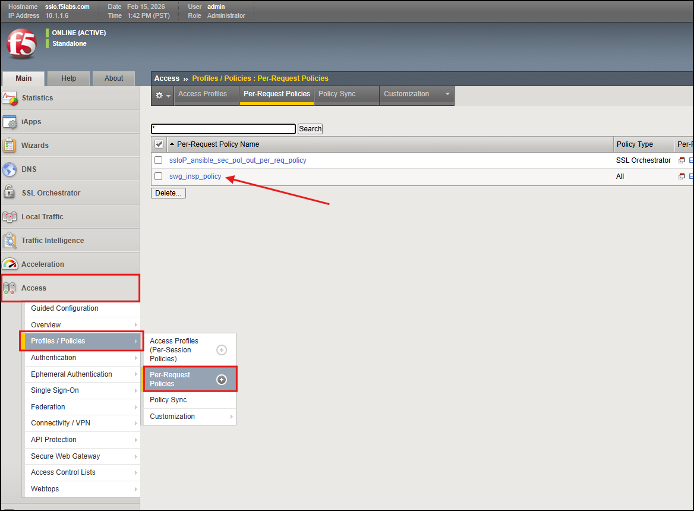
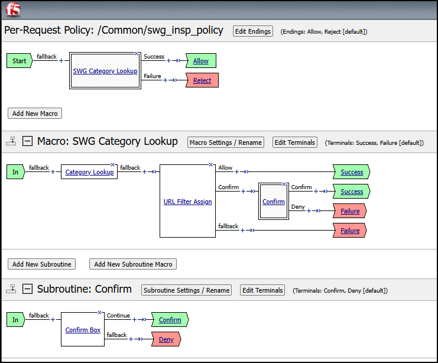
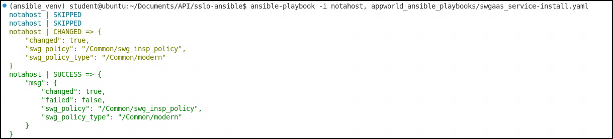
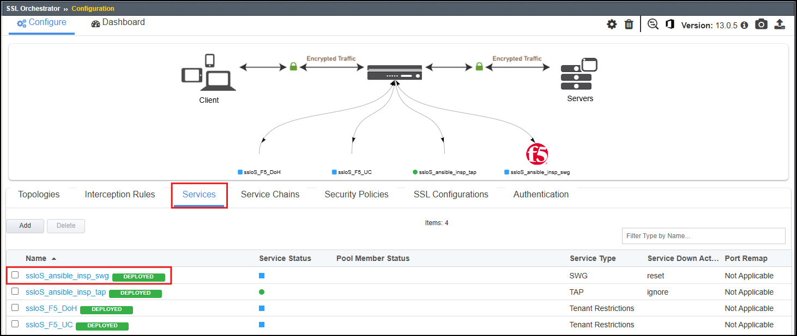
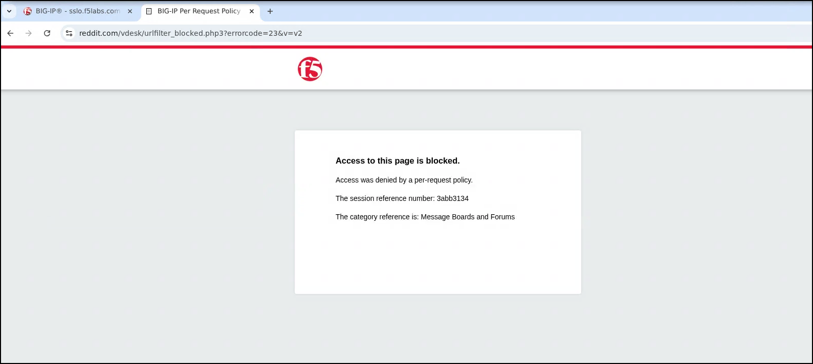

Automating a new SWGaaS Deployment
================================================================================

Within this lab, we will be deploying a new Secure Web Gateway as a Service (SWGaaS) deployment using Ansible Playbooks to automate the configuration on BIG-IP SSL Orchestrator. 

We will accomplishing the following:
 - Review Ansible playbooks needed for this deployment
 - Deploying a new SWG Service using Ansible Playbooks
 - Modifying the existing Service Chain to include the new SWG Service
 - Testing the new SWG Service

|

What is a Secure Web Gateway?
-----------------------------

Secure Web Gateway (SWG) is a forward-proxy security solution that provides protection against web-based threats by enforcing corporate and regulatory policies for internet access. It acts as a barrier between users and the internet, inspecting and filtering web traffic to prevent access to malicious websites, block inappropriate content. SWG can be deployed within BIG-IP SSL Orchestrator and is commonly used to enhance security and control over outbound web traffic.

Building a new SWG Service - Prerequisites
-------------------------------------------------------------------------------

#. To build this new SWG, we will need to ensure there is a necessary prerequisite configuration in place. The BIG-IP SSL Orchestrator SWGaaS Service relies on a pre-existing SWG Per-Request policy built in side the Access portion of BIG-IP. We will confirm it is in place and inspect the flow of the policy to understand how it works.  

#. Go to your BIG-IP SSL Orchestrator GUI a go to Access > Profiles / Policies > Per-Request Policies. You should see the ``swg_insp_polciy`` in place. This is the policy that the SWGaaS Service will rely on to trigger traffic to be sent to the SWGaaS service for inspection. 

|

.. note:: Please let an instructor know if the policy is not in place, as it is a necessary prerequisite for the SWGaaS Service to function properly.   

.. 
   comment:: If the policy is not in place, we can import it from the Ubuntu-Client VSCode instance.  The playbook is located at ``appworld_ansible_playbooks/BIG-IP_SWG_Profile/import_swg_policy.yaml``. You can run the playbook with the following command to import the necessary configuration: ``ansible-playbook -i notahost, appworld_ansible_playbooks/BIG-IP_SWG_Profile/import_swg_policy.yaml``. After running the playbook, refresh the GUI and you should see the policy in place.

#. Here is the example of the flow of the SWG Per-Request policy.

|

#. Now that we have confirmed the necessary prerequisite configuration is in place, we can move on to deploying the new SWGaaS Service.

|

Building a new SWGaaS Service - Install and Assign
-------------------------------------------------------------------------------

#. In order to deploy the new SWG service, we will execute the playbook named ``swgaas-service-install``. Go to the Ubuntu-Client WebRDP session back into VSCode, and execute the following command to run the playbook.

.. code-block:: text

   ansible-playbook -i notahost, appworld_ansible_playbooks/swgaas-service-install.yaml

.. note:: Please let an instructor know if you encounter any errors during the execution.  

|

#. After the playbook has completed successfully, take a few moments to explore the new configuration on the BIG-IP SSL Orchestrator through the GUI. You should see the new SWG Service in place and ready to go. 

|

#. Now that the new service is installed, we will need to attach it to the existing Service Chain ``ansible_chain``.  Additionally, we will modify the Service Chain to *only* use the new SWG Service.  

#. We will use the ``assign-swgaas-chain.yaml`` playbook to remove the Wireshark TAP service ``ansible_insp_tap`` from the Service Chain and assign the new SWGaaS service to the Service Chain. Run the following command to execute the playbook within VSCode on the Ubuntu-Client instance:  

.. code-block:: text

    ansible-playbook -i notahost, appworld_ansible_playbooks/assign-swgaas-chain.yaml

.. note:: Please let an instructor know if you encounter any errors during the execution.

|

Testing the new SWGaaS Service
-------------------------------------------------------------------------------

#. To the new SWGaaS Service, we will be using the same testing methodology as we have in previous labs. We will generate traffic from the Ubuntu-Client WebRDP instance that is steered through the new SWGaaS Service.

#. Open your favorite browser **Chrome** or **Firefox** and attempt to access the ``https://www.reddit.com``. This should trigger the new SWGaaS Service to inspect the traffic and enforce the security policies in place.

|

Conclusion
-------------------------------------------------------------------------------

In this lab, we successfully deployed a new SWGaaS Service using Ansible Playbooks to automate the configuration on BIG-IP SSL Orchestrator. We also modified the existing Service Chain to include the new SWGaaS Service while removing the previous TAP service, and tested it by generating traffic through the service to confirm it was working as expected.