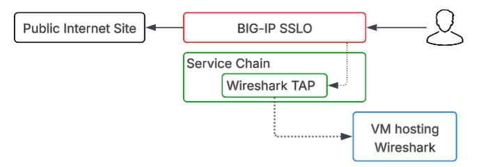

Automating a new L3 Outbound Deployment
================================================================================

In this section, we are working with a clean slate of configuration on the BIG-IP SSL Orchestrator. We will be deploying an Outbound Layer 3 Transparent Proxy Topology with an inline TAP Service for sending a constant stream of data to a Wireshark instance. This will allow us to see the traffic in clear text as it flows through the SSL Orchestrator service, providing valuable insights into the behavior of the traffic and the effectiveness of our configuration.

|

Building a new L3 Outbound Transparent Proxy with the Wireshark TAP Service
-------------------------------------------------------------------------------

#. To build this new L3 Outbound Transparent Proxy, we will be using Ansible Playbooks to automate the configuration process on the BIG-IP SSL Orchestrator. This will allow us to quickly and efficiently deploy the new topology without having to manually configure each component through the GUI.

#. This will be a complete deployment of a new L3 Outbound Transparent Proxy Topology, so the playbook will be building out the following components:

   - New L3 Outbound Transparent Proxy Topology ``ansible_l3_outbound``
   - New TAP Service to send traffic to Wireshark ``ansible_insp_tap``
   - New Service Chain to link the new topology and TAP service together ``ansible_chain``
   - New Security Policy with rules to steer traffic into the new topology ``ansible_sec_pol_out``
   - New SSL Configuration for the new topology ``ansible_ssl_out``

#. Use the following command to deploy the configuration for the new L3 Outbound Transparent Proxy Topology with TAP Service:

   .. code-block:: text

       ansible-playbook -i notahost, appworld_ansible_playbooks/l3_outbound_full_deploy.yaml

   .. note:: Check the output of the playbook execution to ensure that all tasks were completed successfully. If there are any errors, review the output to identify and let a lab assistant know.

#. Once the playbook has completed successfully, take a few moments to explore the new configuration on the BIG-IP SSL Orchestrator through the GUI. You should see the new topology, service, service chain, security policy, and SSL configuration all in place and ready to go.

   .. image:: images/sslo-ansible-deployment.png
      :align: left

   .. image:: images/sslo-ansible-deployment-chain.png
      :align: left
   
   .. 
      comment:: This images/sslo-ansible-deployment.png screenshot might need to be revised for updates to the GUI or the new configuration. 
      2/14/2026

Testing the new the Wireshark TAP Service
-------------------------------------------------------------------------------

Wireshark TAP Service Flow Diagram

#. To test the new Wireshark TAP Service, we will be using the Ubuntu Server instance that is part of our lab environment. This instance has Wireshark installed and configured to capture traffic from the TAP service.

Ubuntu-Server > Access > Wireshark TAP > double click eth1

After you have the wireshark started, go back to the WebRDP session and generate some traffic by accessing a website that will be steered through the new L3 Outbound Transparent Proxy Topology. For example, you can try accessing ``http://www.f5.com``.

Then go back to the Wireshark instance and you should see the traffic flowing through the TAP service in clear text. You can analyze the traffic to see the details of the requests and responses, as well as any potential issues or insights that can be gained from the traffic.  Notice everything is decrypted and in clear text, which is the benefit of having the TAP service in place to capture the traffic before it is re-encrypted and sent on to its destination.